## Cinemize

Trata-se de uma rede social em que os usuários podem postar sugestões de filmes e séries, avaliação, comentário, gênero e onde assistir. Os usuários também podem seguir outros usuários e favoritas postagens.

O projeto possui 7 páginas:

- ```/```: Signup, exibe formulário no qual o usuário cria sua conta;
- ```/login```: Para caso o usuário já possua conta;
- ```/home```: Mostra os posts do usuário e das contas que o mesmo segue;
- ```/profile```: Exibe o eprfil do usuário logado; 
- ```/profile/favorites```: São exibidos as postagens que foram salvas como favorito pelo usuário;
- ```/user/[userName]```: Redireciona para o perfil do usuário que começou a seguir o usuário logado;
- ```/user/posts/[postId]```: Mostra a postagem do usuário logado que foi curtida por outro usuário;


## Sumário

- [Tecnologias utilizadas](#tecnologias)
- [Instruções para rodar o projeto](#instrucoes)
- [Organização e estruturação do projeto](#organizacao)
- [Desenvolvimento](#desenvolvimento)
- [Imagens](#imagens)

## Tecnologias Utilizadas <a name="tecnologias"></a>

### Frontend

- [**NextJS**](https://nextjs.org/)
- [**TailwindCSS**](https://tailwindcss.com/)
- [**React Hook Form**](https://react-hook-form.com/)
- [**Yup**](https://github.com/jquense/yup/)
- [**React Redux**](https://react-redux.js.org/)
- [**Redux Tookit**](https://redux-toolkit.js.org/)
- [**React Icons**](https://react-icons.github.io/react-icons/)
- [**Framer Motion**](https://www.framer.com/)
- [**React Loading Icons**](https://github.com/dkress59/react-loading-icons/)
- [**UUID**](https://github.com/uuidjs/uuid/)
- [**Axios**](https://axios-http.com/docs/intro)
- [**React Rating Stars Component**](https://www.npmjs.com/package/react-rating-stars-component)

### Backend
- [**Mongoose**](https://mongoosejs.com/)
- [**Jose**](https://github.com/panva/jose)
- [**Cookie**](https://github.com/jshttp/cookie/)
- [**BcryptJS**](https://github.com/dcodeIO/bcrypt.js)


## Instruções para rodar o projeto <a name="instrucoes"></a>

### Será necessário ter instalado na sua máquina:

```
Git
NodeJS
```

- Clone o repositório com o comando **git clone**:

```
git clone https://github.com/felipehimself/cinemize.git
```

- Entre no diretório que acabou de ser criado:

```
cd cinemize
```

- Faça a instalação das dependências do projeto:

```
npm install
```

## Organização e estruturação do projeto <a name="organizacao"></a>

O projeto está estruturado da seguinte forma:

```
|   middleware.ts
|   next-env.d.ts
|   next.config.js
|   package-lock.json
|   package.json
|   postcss.config.js
|   README.md
|   tailwind.config.js
|   tsconfig.json
|
+---components
|       Button.tsx
|       CloseIcon.tsx
|       ColorSwitch.tsx
|       ErrorMessage.tsx
|       Fieldset.tsx
|       Form.tsx
|       FormControl.tsx
|       IconLoading.tsx
|       Input.tsx
|       InputError.tsx
|       Label.tsx
|       Loading.tsx
|       Logout.tsx
|       NoDataMsg.tsx
|       NotificationModal.tsx
|       OptionsContainer.tsx
|       PostButton.tsx
|       PostCard.tsx
|       PostForm.tsx
|       ProgressBar.tsx
|       Searchbar.tsx
|       SearchModal.tsx
|       TabButtons.tsx
|       TabContent.tsx
|       TextArea.tsx
|       UserCard.tsx
|       UserFollowerCard.tsx
|       UserProfileCard.tsx
|       UserProfileContainer.tsx
|
+---features
|       formSlice.ts
|       notificationSlice.ts
|       searchSlice.ts
|
+---layouts
|       BottonTab.tsx
|       Header.tsx
|       Layout.tsx
|       Navbar.tsx
|
+---lib
|       framer.ts
|       yup.ts
|
+---models
|       Follow.ts
|       Notification.ts
|       Post.ts
|       User.ts
|
+---pages
|   |   index.tsx
|   |   _app.tsx
|   |
|   +---api
|   |   +---auth
|   |   |       login.ts
|   |   |       logout.ts
|   |   |       signup.ts
|   |   |
|   |   +---follow
|   |   |       index.ts
|   |   |
|   |   +---notification
|   |   |       index.ts
|   |   |
|   |   +---post
|   |   |       favorite.ts
|   |   |       index.ts
|   |   |       like.ts
|   |   |       [postId].ts
|   |   |
|   |   \---user
|   |           profile.ts
|   |           user.ts
|   |
|   +---home
|   |       index.tsx
|   |
|   +---login
|   |       index.tsx
|   |
|   +---profile
|   |       favorites.tsx
|   |       index.tsx
|   |
|   \---user
|       |   [userName].tsx
|       |
|       \---posts
|               [postId].tsx
|
+---public
|       favicon.ico
|       vercel.svg
|
+---store
|       store.ts
|
+---styles
|       globals.css
|
+---ts
|   \---types
|           follow.ts
|           login.ts
|           notification.ts
|           post.ts
|           ui.ts
|           user.ts
|
\---utils
        constants.ts
        createModel.ts
        dbFunctions.ts  
```

## Desenvolvimento <a name="desenvolvimento"></a>

### Frontend

#### [**NextJS**](https://nextjs.org/)

O projeto foi desenvolvido com o framework NextJS, que tem como base o React. Foi utilizada a abordagem ```getServerSideProps```, para gerar as páginas de forma dinâmica com dados sendo servidos pelo banco de dados. A proteção de rotas e a persistência de login foram feitas por meio da utilização de middleware para validar se o usuário está autenticado por meio da verificação do token armazenado nos cookies. 

#### [**TailwindCSS**](https://tailwindcss.com/)

Para estilização dos elementos. 

#### [**React Hook Form**](https://react-hook-form.com/) e [**Yup**](https://github.com/jquense/yup/).

Para controle das informações informadas e validação dos campos dos formulários.

#### [**Redux Toolkit**](https://redux-toolkit.js.org/) e [**React Redux**](https://react-redux.js.org/)

Para controle de estados entre as telas da aplicação.

#### [**React Icons**](https://react-icons.github.io/react-icons/)

Para ícones SVG utilizados na aplicação.

#### [**Framer Motion**](https://www.framer.com/)

Para animações e transições.

#### [**React Loading Icons**](https://github.com/dkress59/react-loading-icons/)

Para demonstração de espera na transição de páginas e chamadas HTTP.

#### [**UUID**](https://github.com/uuidjs/uuid/)

Para gerar identificadores únicos de cada pedido do cliente.

#### [**Axios**](https://axios-http.com/docs/intro)

Para realizar chamadas HTTP.

#### [**React Rating Stars Component**](https://www.npmjs.com/package/react-rating-stars-component)

Componente para selecionar a nota dada para a postagem (filme ou série)


### Backend

#### [**Mongoose**](https://mongoosejs.com/)

Abordagem NOSQL utilizado como banco de dados da aplicação.

#### [**Jose**](https://github.com/panva/jose)

Utilizado para geração do JSON Web Token (JWT).

#### [**Cookie**](https://github.com/jshttp/cookie/)

Utilizado para serializar e armazenar o JWT nos cookies da requisição.

#### [**BcryptJS**](https://github.com/dcodeIO/bcrypt.js)

Utilizado para criptografar as senhas dos usuários antes de salvar no banco de dados.


## Imagens <a name="imagens" ></a>

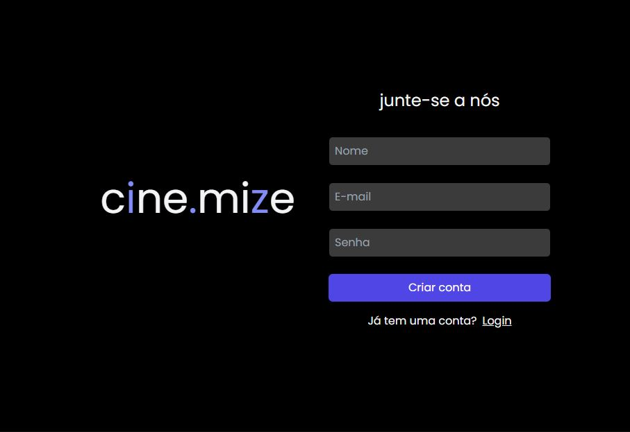 
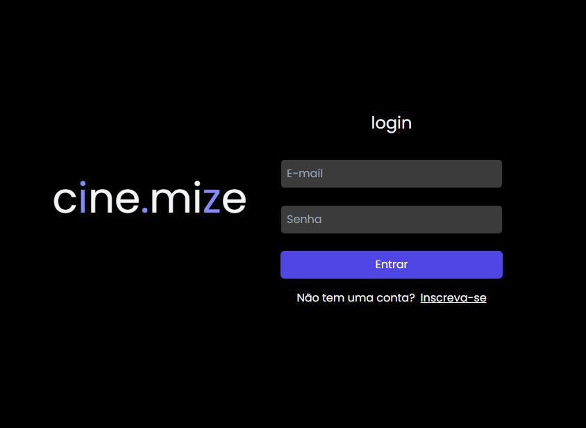 
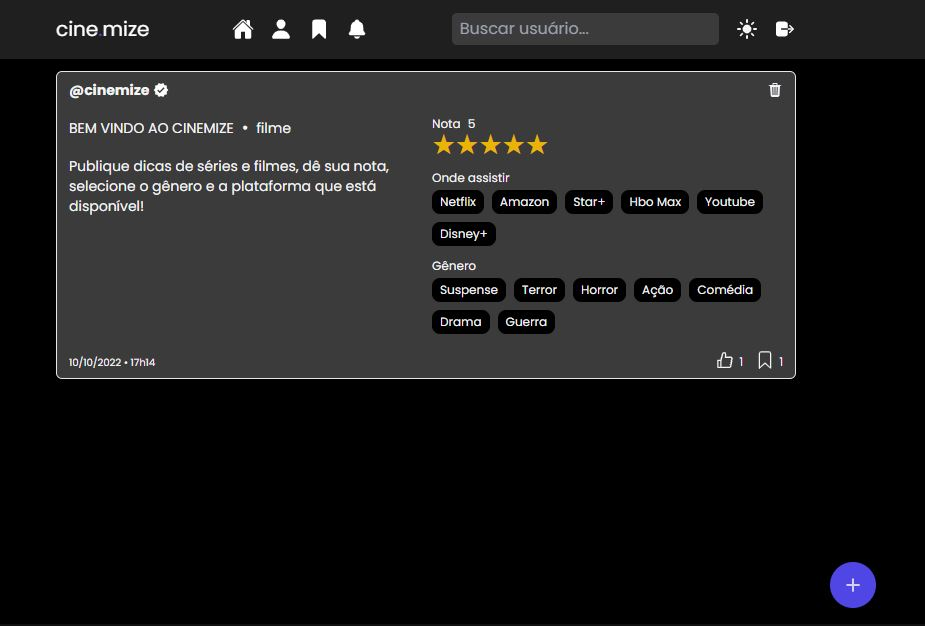 
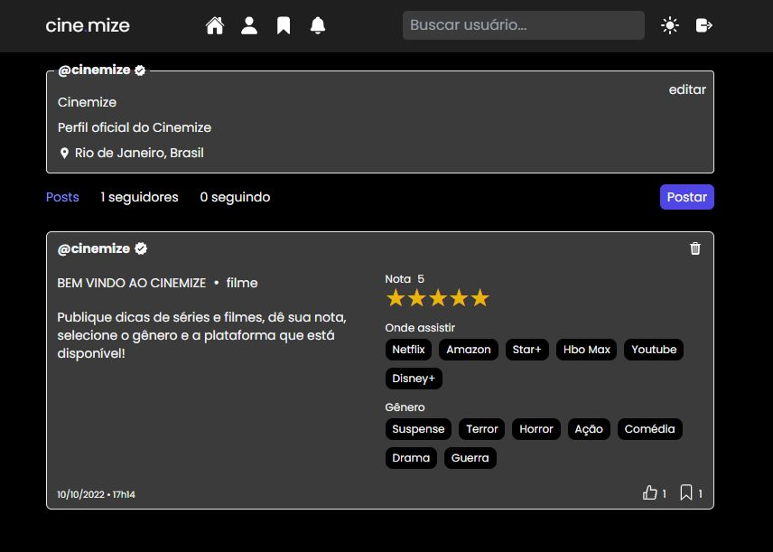 
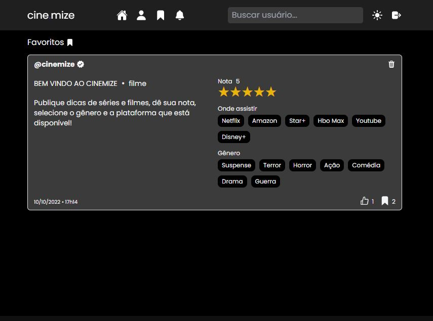 
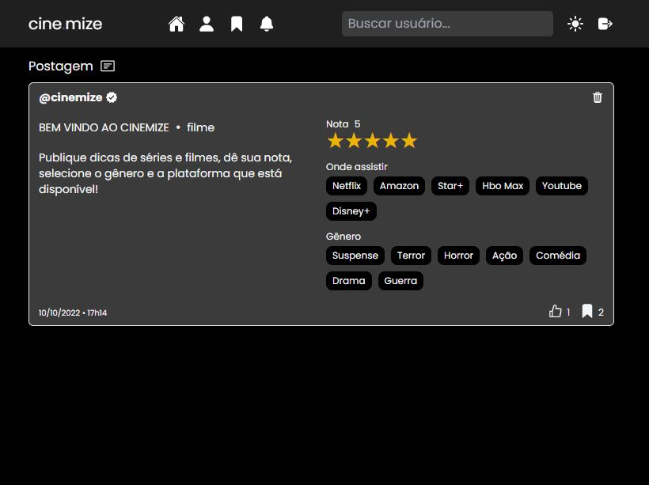 

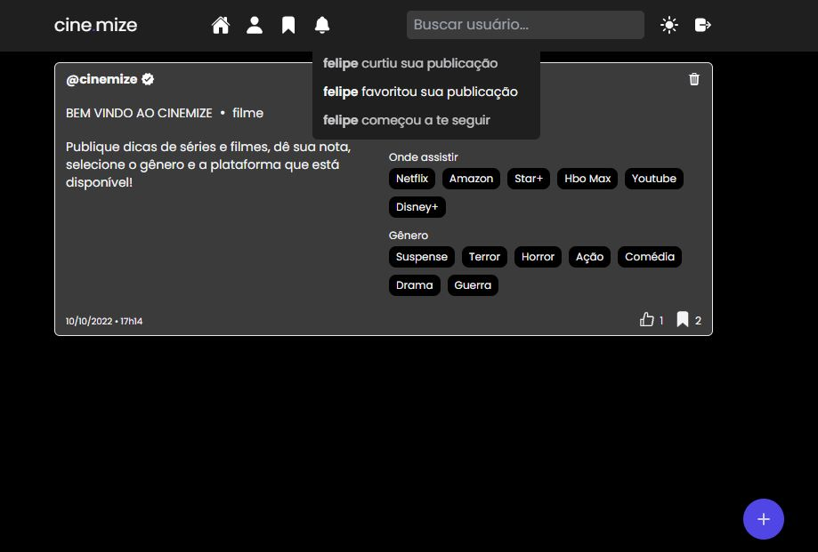 
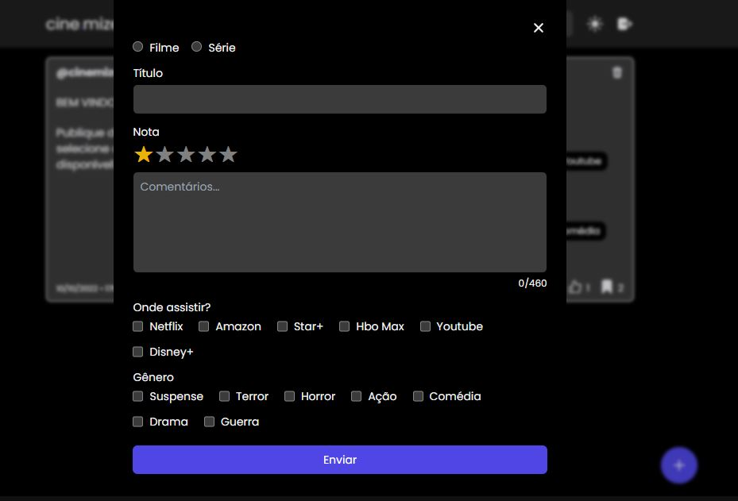 

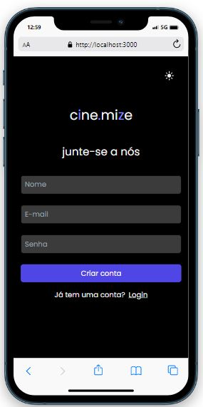 
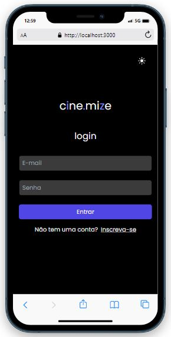 
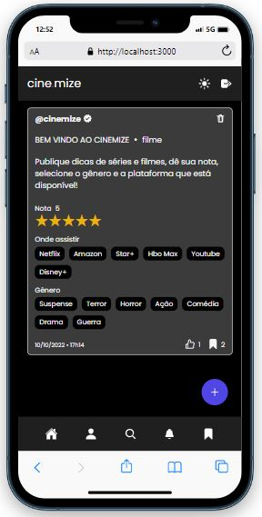 
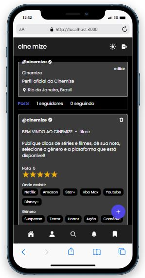
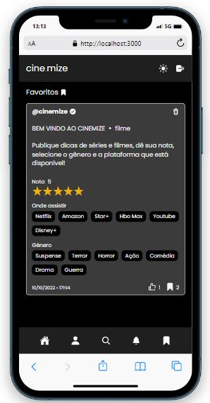 
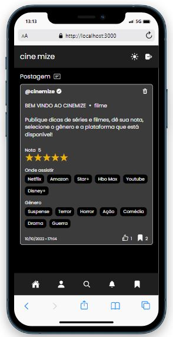 
 
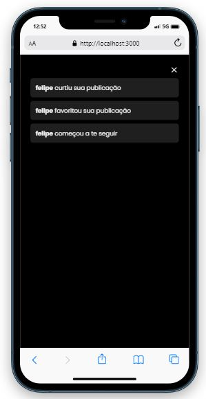 
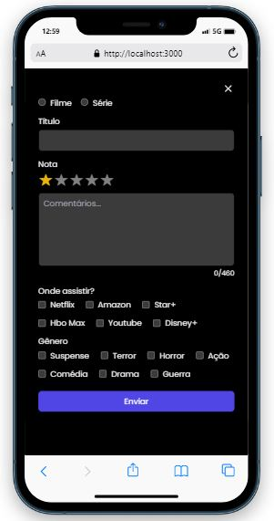 

